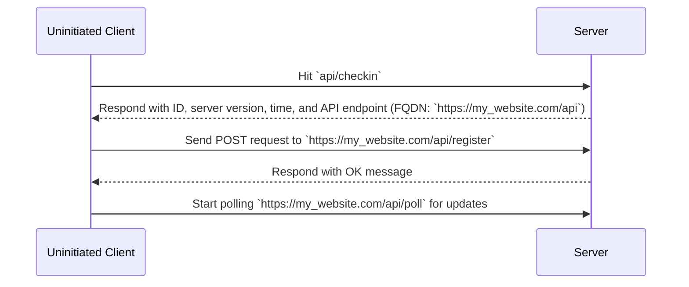

# Development server for silvertech gif controlled signs

## How to Run
1. Deps are managed with pipenv (but you could use any env manager), `pipenv install -r requirements.txt` then `pipenv shell`
2. Start the server: `flask run --debug`
3. Open `http://127.0.0.1:5000` in your browser.

## Checkin Process

Potentially not the best process (as if two machines want to check in at exactly the same time, it can get messy)
But its what i went with for now!

